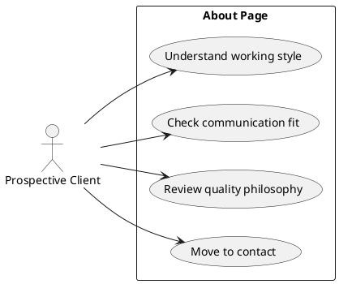

# Page Spec: About

Status: Accepted

Date: 2026-06-02

## Purpose

Provide professional context, working style, constraints, and quality philosophy without turning the page into a personal biography.

## Route

| Route    | Rendering | Data owner        |
| -------- | --------- | ----------------- |
| `/about` | Static    | `load-about-page` |

## Content Requirements

| Block                | Content                                        | Source                       | Notes                                          |
| -------------------- | ---------------------------------------------- | ---------------------------- | ---------------------------------------------- |
| Professional context | Role, positioning, experience shape.           | Site metadata/about content. | Human but work-focused.                        |
| Working style        | How engagements are run.                       | About content.               | Practical constraints and collaboration model. |
| Quality philosophy   | Architecture, testing, maintainability stance. | About content.               | Supports trust.                                |
| Languages/timezone   | Availability and communication.                | Site metadata.               | Helps fit.                                     |
| CTA                  | Contact or services link.                      | Contact metadata.            | Clear next step.                               |

## Initial State

The visitor sees professional context and working style without personal storytelling dominating the page.

## Loading State

No visible loading state for static content.

## Failure State

Missing required about metadata fails build. Optional availability notes can fall back to generic contact CTA if configured.

## View Transitions

```txt
about page
  -> select services link
  -> Services initial state

about page
  -> select contact CTA
  -> Contact initial state
```

## User Stories



## Acceptance Criteria

- Working style and constraints are explicit.
- Availability and communication context are easy to scan.
- The page includes a clear next step.

## Accessibility Requirements

- Content follows semantic heading order.
- CTA links have descriptive text.
- Long prose remains within readable measure.

## Related Documents

- `docs/page-specs/portfolio_page_specs.md`
- `docs/content-models/portfolio_content_models.md`
- `docs/ui/styling-conventions.md`
