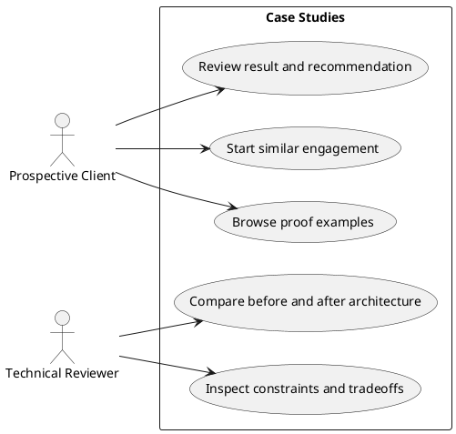

# Page Spec: Case Studies

Status: Proposed

Date: 2026-06-02

## Purpose

Show technical thinking through privacy-safe project proof, including constraints, decisions, tradeoffs, architecture changes, and results.

## Route

| Route                  | Rendering             | Data owner                     |
| ---------------------- | --------------------- | ------------------------------ |
| `/case-studies`        | Static                | `load-case-studies-index-page` |
| `/case-studies/[slug]` | Static dynamic routes | `load-case-study-page`         |

## Content Requirements

| Block                 | Content                                               | Source                   | Notes                              |
| --------------------- | ----------------------------------------------------- | ------------------------ | ---------------------------------- |
| Index intro           | Proof framing.                                        | Site metadata.           | Explains redacted/synthetic proof. |
| Case cards            | Title, summary, constraints, result, redaction label. | `caseStudies`.           | V1.5 minimum two entries.          |
| Detail problem        | Context, constraints, problem.                        | `caseStudies`.           | Required by FR-03.                 |
| Detail decisions      | ADR-style decisions and tradeoffs.                    | `caseStudies`.           | Shows senior reasoning.            |
| Before/after          | Architecture comparison.                              | `caseStudies/systemMap`. | Static fallback required.          |
| Evidence              | Diagrams, snippets, findings, metrics.                | `caseStudies`.           | Privacy-safe.                      |
| Result/recommendation | Outcome and next step.                                | `caseStudies`.           | Must be concrete.                  |

## Initial State

Index starts with a concise explanation of how to read redacted proof. Detail pages start with the case problem, constraints, and outcome summary.

## Loading State

No visible loading state for static case pages. Hydrated before/after toggles show static content first.

## Failure State

- Invalid case study content fails build.
- Missing redaction status fails build.
- Unknown slug renders 404.
- Invalid before/after island data renders static before/after sections.

## View Transitions

```txt
case index
  -> select case card
  -> case detail initial state

case detail
  -> toggle before/after
  -> explicit architecture state

case detail
  -> select contact CTA
  -> Contact with case-study context
```

## User Stories



## Acceptance Criteria

- Case cards show redaction status.
- Detail pages include problem, constraints, decisions, tradeoffs, before/after, evidence, result, and recommendation.
- Unknown slugs render 404.

## Accessibility Requirements

- Before/after controls are keyboard accessible.
- Static before/after content is available without client JavaScript.
- Diagrams include text alternatives.

## Related Documents

- `docs/page-specs/portfolio_page_specs.md`
- `docs/content-models/portfolio_content_models.md`
- `docs/data-flows/content-to-page-data-flow.md`
