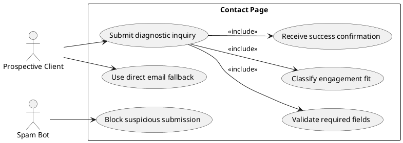

# Page Spec: Contact

Status: Accepted

Date: 2026-06-02

## Purpose

Convert good-fit leads through a scoped engineering diagnostic intake flow.

## Route

| Route      | Rendering                                | Data owner                                   |
| ---------- | ---------------------------------------- | -------------------------------------------- |
| `/contact` | Static page with server/contact workflow | `load-contact-page`, `submit-contact-intake` |

## Content Requirements

| Block            | Content                                                                               | Source                       | Notes                       |
| ---------------- | ------------------------------------------------------------------------------------- | ---------------------------- | --------------------------- |
| Intro            | Scoped diagnostic framing.                                                            | Site metadata/contact rules. | Not a generic message form. |
| Intake form      | Product, Angular version, team size, pain, engagement type, timeline, budget comfort. | Contact schema.              | Required by FR-07.          |
| Availability     | Timing, constraints, fit rules.                                                       | Site metadata.               | Set expectations.           |
| Non-fit criteria | Work not accepted.                                                                    | Site metadata/services.      | Reduces poor-fit leads.     |
| Direct contact   | Email/social.                                                                         | Site metadata.               | Fallback path.              |

## Initial State

The visitor sees the diagnostic framing, form fields, availability constraints, and direct contact fallback.

## Loading State

- Static page content has no visible loading state.
- During form submission, disable submit button, preserve field values, and announce submitting status.
- If JavaScript enhancement is unavailable, server response should still return success or accessible error state where deployment supports it.

## Failure State

| Failure                  | Behavior                                                                |
| ------------------------ | ----------------------------------------------------------------------- |
| Field validation failure | Show field-level errors and an error summary.                           |
| Missing consent          | Keep form values and focus consent/error summary.                       |
| Spam blocked             | Show generic blocked/unavailable response without exposing spam rules.  |
| Delivery failure         | Show retry and direct-email fallback.                                   |
| Config failure           | Show contact temporarily unavailable and direct-email fallback if safe. |

## View Transitions

```txt
contact initial
  -> user edits fields
  -> dirty form state
  -> submit
  -> submitting state
  -> success state

contact initial
  -> submit invalid data
  -> validation error state
  -> corrected form
  -> submitting state
  -> success state

submitting state
  -> delivery failure
  -> retry/direct-email fallback
```

## User Stories



## Acceptance Criteria

- Required fields match the contact data-flow spec.
- Validation errors are field-level and summarized.
- Submission has submitting, success, validation failure, spam, delivery failure, and config failure states.
- Direct email fallback is available where safe.

## Accessibility Requirements

- Error summary is announced and linked to fields.
- Submit state is announced without removing form context.
- Disabled/loading states remain visually clear.
- Form works with keyboard and screen-reader navigation.

## Related Documents

- `docs/page-specs/portfolio_page_specs.md`
- `docs/data-flows/contact-intake-data-flow.md`
- `docs/error-models/portfolio_error_model.md`
