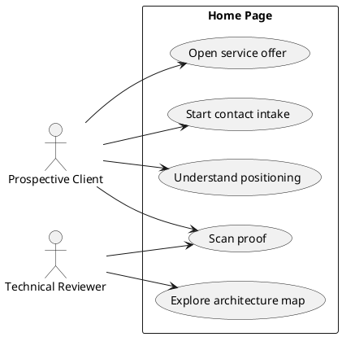

# Page Spec: Home

Status: Proposed

Date: 2026-06-02

## Purpose

Introduce the portfolio positioning, make frontend systems expertise visible, and move good-fit visitors toward services, proof, or contact.

## Route

| Route | Rendering                               | Data owner       |
| ----- | --------------------------------------- | ---------------- |
| `/`   | Static with optional interactive island | `load-home-page` |

## Content Requirements

| Block                 | Content                                                   | Source                                     | Notes                                                             |
| --------------------- | --------------------------------------------------------- | ------------------------------------------ | ----------------------------------------------------------------- |
| Hero                  | Specialization, core outcome, primary CTA, secondary CTA. | Site metadata/services/system map.         | Must be visible without scrolling on desktop and high-end mobile. |
| Hero system map       | Messy-to-explicit architecture visual.                    | `systemMap`.                               | Basic static fallback in V1.                                      |
| Proof strip           | Credibility scan.                                         | Site metadata/case studies/audit findings. | Short, concrete proof points.                                     |
| Services preview      | Buyable offers.                                           | `services`.                                | Each card links to Services or Contact.                           |
| Selected case studies | Technical depth preview.                                  | `caseStudies`.                             | V1.5 content; V1 may use placeholder proof/audit preview.         |
| Map preview           | Architectural metaphor continuation.                      | `systemMap`.                               | Avoid duplicate heavy interaction.                                |
| Lab preview           | Technical writing proof.                                  | `labPosts`.                                | V1.5 content.                                                     |
| CTA                   | Diagnostic/contact prompt.                                | Site metadata/contact rules.               | Clear conversion path.                                            |

## Initial State

The visitor sees the positioning, concise proof, and primary CTA immediately. The system map appears in a calm static or lightly animated state.

## Loading State

- Static content has no visible loading state.
- If the system map island hydrates, static SVG/text remains visible during hydration.

## Failure State

- Missing hero/service metadata fails build.
- Invalid system map island data renders static fallback if fallback data is valid.
- Missing optional case/lab previews are omitted only if V1 minimum content still passes.

## View Transitions

```txt
initial hero
  -> select primary CTA
  -> Contact initial state

initial hero
  -> select service card
  -> Services detail section

system map static view
  -> hover/focus/tap node
  -> risk/technique detail
  -> return to default map state
```

## User Stories



## Acceptance Criteria

- Hero positioning and primary CTA are visible in the first viewport.
- Core content renders without critical client JavaScript.
- System map has a static fallback.
- Primary CTAs route to Services or Contact.

## Accessibility Requirements

- Hero heading is the page `h1`.
- System map has text equivalent content.
- CTA focus states are visible.
- Reduced motion disables non-essential map animation.

## Related Documents

- `docs/page-specs/portfolio_page_specs.md`
- `docs/architecture/portfolio_architectural_foundation.md`
- `docs/content-models/portfolio_content_models.md`
