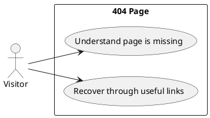

# Page Spec: Not Found

Status: Proposed

Date: 2026-06-02

## Purpose

Help visitors recover from unknown or outdated routes.

## Route

| Route | Rendering | Data owner |
|---|---|---|
| `404` | Static | `load-not-found-page` or static metadata |

## Content Requirements

| Block | Content | Source | Notes |
|---|---|---|---|
| 404 message | Clear missing page explanation. | Site metadata. | No distracting joke copy. |
| Recovery links | Home, Services, Case Studies, Contact. | Navigation metadata. | Helps users recover. |

## Initial State

The visitor sees a clear not-found message and recovery links.

## Loading State

No visible loading state.

## Failure State

If navigation metadata is unavailable, render hard-coded core links.

## View Transitions

```txt
unknown route
  -> 404
  -> select recovery link
  -> target page initial state
```

## User Stories



## Acceptance Criteria

- The page clearly communicates that the route is missing.
- Recovery links include Home, Services, Case Studies, and Contact.
- The page does not depend on client JavaScript.

## Accessibility Requirements

- The 404 message is the page `h1`.
- Recovery links are keyboard accessible.
- Focus order is simple and predictable.

## Related Documents

- `docs/page-specs/portfolio_page_specs.md`
- `docs/architecture/portfolio_architectural_foundation.md`

