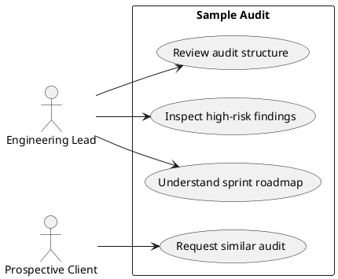

# Page Spec: Sample Audit

Status: Proposed

Date: 2026-06-02

## Purpose

Make the audit service tangible through a realistic, privacy-safe Angular audit report.

## Route

| Route           | Rendering | Data owner               |
| --------------- | --------- | ------------------------ |
| `/sample-audit` | Static    | `load-sample-audit-page` |

## Content Requirements

| Block          | Content                              | Source                       | Notes                     |
| -------------- | ------------------------------------ | ---------------------------- | ------------------------- |
| Audit intro    | What the sample report demonstrates. | Site metadata/audit content. | Make audit tangible.      |
| Severity list  | Findings by severity.                | `auditFindings`.             | Critical/high/medium/low. |
| Finding detail | Evidence, risk, recommendation.      | `auditFindings`.             | Required by FR-06.        |
| Risk matrix    | Severity and impact visualization.   | `auditFindings`.             | Static, accessible.       |
| Roadmap        | Sprint recommendation.               | `auditFindings`.             | Shows prioritization.     |
| CTA            | Request diagnostic.                  | Contact metadata.            | Links to Contact.         |

## Initial State

The visitor sees a report-like audit overview with severity distribution and the highest-risk findings.

## Loading State

No visible loading state for static audit content.

## Failure State

- Missing required findings fails build.
- Invalid severity values fail build.
- Invalid risk matrix data falls back to severity list only if findings are still valid.

## View Transitions

```txt
audit overview
  -> select severity/filter
  -> findings matching severity

audit overview
  -> select finding
  -> finding detail anchor or expanded section

audit overview
  -> select diagnostic CTA
  -> Contact with audit context
```

## User Stories



## Acceptance Criteria

- Audit findings include severity, evidence, risk, and recommendation.
- Risk matrix has a text/list equivalent.
- Diagnostic CTA routes to Contact with audit context.

## Accessibility Requirements

- Severity is not communicated by color alone.
- Expandable finding details preserve keyboard access.
- Risk matrix includes readable labels and text fallback.

## Related Documents

- `docs/page-specs/portfolio_page_specs.md`
- `docs/content-models/portfolio_content_models.md`
- `docs/data-flows/content-to-page-data-flow.md`
