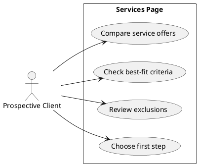

# Page Spec: Services

Status: Accepted

Date: 2026-06-02

## Purpose

Turn technical capabilities into clear, buyable offers with fit guidance and conversion paths.

## Route

| Route       | Rendering | Data owner           |
| ----------- | --------- | -------------------- |
| `/services` | Static    | `load-services-page` |

## Content Requirements

| Block              | Content                                         | Source                        | Notes                                |
| ------------------ | ----------------------------------------------- | ----------------------------- | ------------------------------------ |
| Intro              | What problems the services solve.               | Site metadata/services.       | Clear consulting/contractor framing. |
| Offer comparison   | Service cards with pain, output, best fit, CTA. | `services`.                   | Required by FR-02.                   |
| Deliverables       | Concrete outputs by service.                    | `services`.                   | Avoid vague capability lists.        |
| Best fit / not fit | Qualification criteria.                         | `services` and site metadata. | Helps conversion quality.            |
| First step         | Diagnostic CTA.                                 | Site metadata/contact.        | Links to Contact.                    |

## Initial State

The visitor sees service positioning and offer comparison without needing to understand implementation details first.

## Loading State

No visible loading state for static content.

## Failure State

Missing or invalid service content fails build. If fewer than the required services exist, the page fails build.

## View Transitions

```txt
services overview
  -> select service CTA
  -> Contact with service context

services overview
  -> select related proof
  -> Case Study or Sample Audit
```

## User Stories



## Acceptance Criteria

- Every service includes client pain, output, best fit, exclusions, and CTA.
- Contact CTA can carry service context.
- Missing required services fails validation/build.

## Accessibility Requirements

- Offer comparison uses semantic headings.
- CTA links have descriptive accessible names.
- Cards do not rely on hover to reveal essential information.

## Related Documents

- `docs/page-specs/portfolio_page_specs.md`
- `docs/content-models/portfolio_content_models.md`
- `docs/data-flows/content-to-page-data-flow.md`
