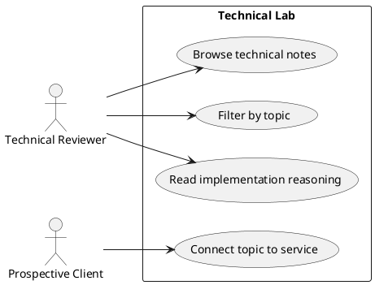

# Page Spec: Technical Lab

Status: Proposed

Date: 2026-06-02

## Purpose

Provide public proof of technical thinking through focused notes and demos.

## Route

| Route | Rendering | Data owner |
|---|---|---|
| `/lab` | Static | `load-lab-page` |
| `/lab/[slug]` | Static dynamic routes | `load-lab-post-page` |

## Content Requirements

| Block | Content | Source | Notes |
|---|---|---|---|
| Lab intro | Technical writing positioning. | Site metadata. | Public proof of thinking. |
| Topic filters | Angular, RxJS, TypeScript, Architecture. | `labPosts`. | Should work without hiding content from no-JS users. |
| Lab cards | Title, summary, takeaway, topic. | `labPosts`. | Four initial required topics. |
| Post detail | Explanation, snippet, outcome, related service. | `labPosts`. | Avoid code flood. |

## Initial State

The visitor sees all lab entries grouped or filterable by topic, with the practical takeaway visible.

## Loading State

Static lab content has no visible loading state. If filtering is enhanced client-side, all entries are visible before hydration.

## Failure State

- Fewer than four required lab topics fails V1.5 content validation.
- Unknown slug renders 404.
- Invalid code snippet metadata falls back to plain preformatted code or fails build if required.

## View Transitions

```txt
lab index
  -> select topic filter
  -> filtered list

lab index
  -> select lab post
  -> lab detail initial state

lab detail
  -> select related service
  -> Services relevant section
```

## User Stories



## Acceptance Criteria

- The lab index exposes all required initial topics.
- Filtering does not hide content from no-JS users.
- Lab posts link back to relevant services where applicable.

## Accessibility Requirements

- Filters are keyboard accessible.
- Code snippets remain readable in light and dark mode.
- Topic labels are text, not color-only.

## Related Documents

- `docs/page-specs/portfolio_page_specs.md`
- `docs/content-models/portfolio_content_models.md`
- `docs/data-flows/content-to-page-data-flow.md`

