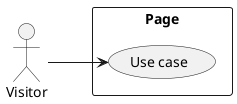

# Page Spec: Title

Status: Draft

Date: YYYY-MM-DD

## Purpose

Describe the page goal and the user need it supports.

## Route

| Route | Rendering | Data owner |
|---|---|---|
| `/example` | Static/server/client island | Example loader/program |

## Content Requirements

| Block | Content | Source | Notes |
|---|---|---|---|
| Example block | Example content. | Example collection. | Example note. |

## Initial State

Define what the user sees before interaction.

## Loading State

Define build-time, server-time, and client-time loading behavior where relevant.

## Failure State

Define behavior for missing content, invalid data, route errors, client island errors, and service failures.

## View Transitions

Describe navigation, section changes, toggles, filters, forms, and interactive states.

```txt
initial
  -> interaction
  -> result
```

## User Stories

Use UML for supported use cases.



## Acceptance Criteria

- Observable behavior required for the page.

## Accessibility Requirements

- Keyboard behavior
- Focus management
- Heading structure
- Error announcements
- Reduced-motion behavior

## Related Documents

- Related architecture, data flow, content model, UI convention, and ADR docs.

